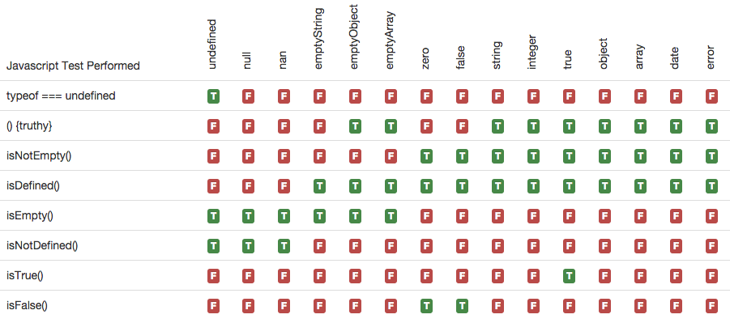

    

simple-js-validator
===============

Perform simple javascript validation like isEmpty and isDefined in a consistent manner.

### The trials and tribulations of the truthy test

	if (someVar) {
		// do something
	}

In javascript, the typical truthy test is if(someVar) or if(!someVar).  In my opinion, this does not always work as expected.  This is probably due to the fact that I use the truthy test to perform two distinct tests.  It is used to check if someVar is true and it is used to check if something "exists".  But I don't think it behaves as one would expect in either case…it's close, but not 100%

#### As a "true" test
If using this as a test to see if someVar = true, it works as expected…for the most part.  It is a little odd to me that an empty object or array "equals" true. Or any integer (except 0), object, array, date, or string also "equals" true.  It might be that eventhough it is a "truthy" test, it is not meant to be "equals" true.  That just might be my c# background coming through there.

#### As an "existance" test
If using this as a test to see if something "exists", it really doesn't work as expected either.  To me a value of false or 0 exist.  And whether you think an empty object or an array "exist" or not…Do you consider being empty existing?…it strikes me as odd that an empty object/array returns true, but an empty string returns false.  Doesn't seem consistent.

I am sure there are reasons why the test perfroms the way it does and I might be just using it incorrectly, but too many times I have had to go back and debug some if statement because of the above scenarios.

##### typeof === undefined
Furthermore, the typeof undefined test is not how I would expect…or maybe prefer is the better term.  Yes, it tells you if it is "undefined", but to me null is not defined.  I didn't want to have to perform two checks everytime I want to use an object becuase the following code works fin

	//THIS WORKS                         	|	//THIS FAILS
	var someVar;                         	|	var someVar = null;
	if (typeof someVar !== undefined) {  	|   if (typeof someVar !== undefined) {
		someVar.foo = "bar"          		|      someVar.foo = "bar"
	}                                    	|   }

And if you expected to have a number and you got NaN…then technically that is not defined.  Probably just semantics or my OCD programming.

#### simple javascript validators
From the above scenarios, I created several simple functions that will output exactly what I expect them to.  I decided to break apart the "existance" test into isDefined (meaning empty things are defined) and isEmpty (meaning it must contain something).  

In a future version, I will also add a isTrue which will only return true if the value is "true", 1, or true and an isFalse which will only return true if the value is "false", 0, or false

#### Visualize….and ATTACK

Here is a simple table to illustrate the differences.

Please see the <a href="http://dkhunt27.github.io/simpleJSValidator/#!/api/SimpleJS.Validator" target="_blank">docs/index.html</a> for more details. If link does not work, just open the index.html in the docs folder.

# Installation

	npm install simple-js-validator

# Usage

###client side (browser)

	
	

###server side (Node)

	var sjv = require('simple-js-validator');
    var someVar;
    if (sjv.isDefined(someVar)) {
        // do something 
    }
        	
    if (sjv.isEmpty(someVar)) {
        // do something else
    }
	
# Road Map
<table>
	<tr>
		<td>1.0</td>
		<td>isEmpty, isNotEmpty, isDefined, and isNotDefined functions.</td>
	</tr>
	<tr>
		<td></td>
		<td>Works in client (browser) and server (Node).</td>
	</tr>
	<tr>
		<td></td>
		<td>100% unit test coverage.</td>
	</tr>
	<tr>
		<td></td>
		<td>Use grunt to build, minify, test, jshint, and publish package.</td>
	</tr>
	<tr>
		<td></td>
		<td>Publish to npm with only required files.</td>
	</tr>
	<tr>
		<td></td>
		<td>Documentation on installation, use cases, and code examples.</td>
	</tr>
	<tr>
		<td>1.1</td>
		<td>isTrue function that only returns true if "true", true, or 1 and inverse isFalse function</td>
	</tr>
	<tr>
		<td>1.2</td>
		<td>isAsExpected where user can define their expected results for each case.</td>
	</tr>
	<tr>
		<td>1.3</td>
		<td>Update isEmpty, isNotEmpty, isDefined, and isNotDefined functions to use config so user can redefine to their expectations (if different from default).  Essentially the same thing as isAsExpected, but this way they can use the easier to read isEmpty, isNotEmpty, isDefined, and isNotDefined names.</td>
	</tr>
</table>
 
### Note to myself

- Make sure working in dev branch
- When updates are complete, run "npm test" or "npm run-script test-travis" to verify all tests are passing without or with test coverage.  
- Run "grunt hint" to verify all jshint checks are passing.
- Run "grunt bump" to update version (grunt bump:patch, grunt bump:minor) or update package.json directly
- Update release history and version ref at top of sjv js file
- Then run "grunt release".
- When it is complete, git commit, git push, and git push --tags
- Wait for travis build confirmation
- Make pull request to master
- Wait for travis build confirmation
- Pull down master locally
- Just to verify, run "grunt test" to verify all tests are passing.  Run "grunt hint" to verify all jshint checks are passing.
- Run "npm publish"
- Go back to dev branch
- Cele!!!

# Release History
<table>
	<tr>
		<td>0.12.1</td>
		<td>2016/4/1</td>
		<td>Fixed bug in isObject populated object test.  Added isNotObject, isEmptyObject, isNotEmptyObject, isNotArray, isEmptyArray, isNotEmptyArray</td>
	</tr>
	<tr>
		<td>0.12.0</td>
		<td>2016/4/1</td>
		<td>Added more test coverage; wire up coveralls.io</td>
	</tr>
	<tr>
		<td>0.11.5</td>
		<td>2015/12/18</td>
		<td>Added bower support</td>
	</tr>
	<tr>
		<td>0.11.3</td>
		<td>2015/02/05</td>
		<td>Added CallbackOnError to the validate methods</td>
	</tr>
	<tr>
		<td>0.10.1</td>
		<td>2014/10/02</td>
		<td>Added isTrue and isFalse. Minor update to improve error message. Updated all dependencies</td>
	</tr>
	<tr>
		<td>0.9.12</td>
		<td>2014/03/10</td>
		<td>Added setPropertyByString.</td>
	</tr>
	<tr>
		<td>0.9.9</td>
		<td>2013/08/28</td>
		<td>Updated isEmpty to handle new Error() correctly.</td>
	</tr>
	<tr>
    <td></td>
    <td></td>
    <td>Added isDate, isArray, isObject helper functions.</td>
  </tr>
	<tr>
    <td></td>
    <td></td>
    <td>Added functions to ease the checking of functions inputs/objects.</td>
  </tr>
	<tr>
		<td></td>
		<td></td>
		<td>Works in client (browser) and server (Node).</td>
	</tr>
  <tr>
    <td>0.9.8</td>
    <td>2013/08/15</td>
    <td>Improved documentation.</td>
  </tr>
  <tr>
    <td></td>
    <td></td>
    <td>Works in client (browser) and server (Node).</td>
  </tr>
	<tr>
		<td>0.9.7</td>
		<td>2013/07/30</td>
		<td>Initial Release.</td>
	</tr>
	<tr>
		<td></td>
		<td></td>
		<td>isEmpty, isNotEmpty, isDefined, and isNotDefined functions.</td>
	</tr>
	<tr>
		<td></td>
		<td></td>
		<td>Assert (throw an error) for the functions.</td>
	</tr>
	<tr>
		<td></td>
		<td></td>
		<td>Works in server.</td>
	</tr>
	<tr>
		<td></td>
		<td></td>
		<td>Test coverage is high, but not 100%.</td>
	</tr>
	<tr>
		<td></td>
		<td></td>
		<td>Uses grunt to build, minify, test, jshint, and publish package.</td>
	</tr>
	<tr>
		<td></td>
		<td></td>
		<td>Also using travis for CI.</td>
	</tr>
	<tr>
		<td></td>
		<td></td>
		<td>Initial documentation.</td>
	</tr>
</table>

